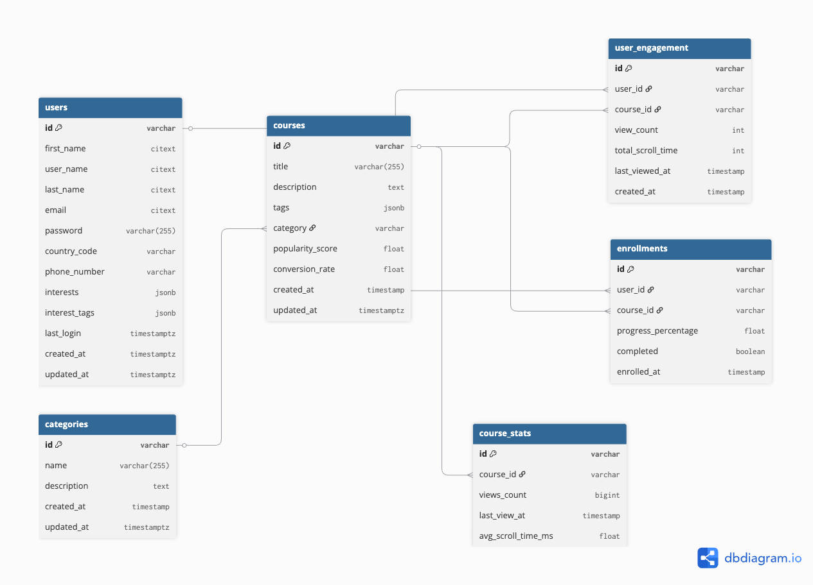

## Requirements

For development, you will only need Node.js (version 20 and above) and a node global package installed in your environment.

### Node

- #### Node installation on Windows

    Just go on [official Node.js website](https://nodejs.org/) and download the installer.
    Also, be sure to have `git` available in your PATH, `npm` might need it (You can find git [here](https://git-scm.com/)).

## Application Project Installation

  $ git clone 
  $ cd 
  $ npm install

---

## Configure app

create a  `.env` file to the root folder then add url to your db to connect your postgres DBs. 
An example of the structure of the `.env` is seen in `.env.example` file.

---

## Running migrations

    $ npm run migrate:create {migrationName} (to add new migration files)
    $ npm run migrate:up (to run up migrations)
    $ npm run migrate:down (to run down migrations)
    $ npm run seed:create {seedName} (to add new seed files)
    $ npm run seed:up (to run up seed)
    $ npm run seed:down (to run down seed)

---

---
